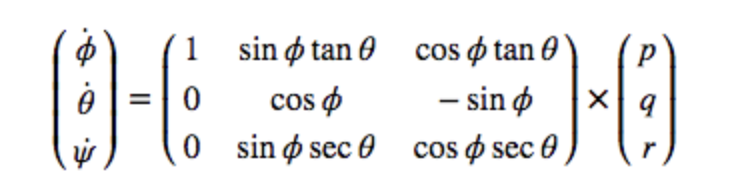
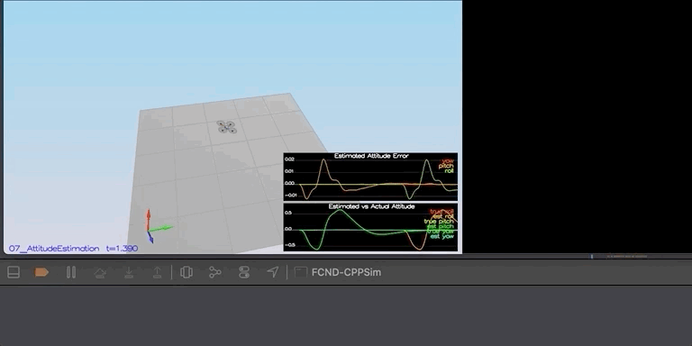
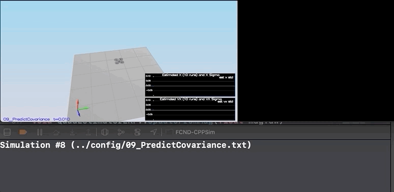

# Estimation Project #

Welcome to the estimation project.  In this project, you will be developing the estimation portion of the controller used in the CPP simulator.  By the end of the project, your simulated quad will be flying with your estimator and your custom controller (from the previous project)!

This README/Writeup is broken down into the following sections:

## Submission ##

For this project, you will need to submit:

 - a completed estimator that meets the performance criteria for each of the steps by submitting:
   - `QuadEstimatorEKF.cpp`
   - `config/QuadEstimatorEKF.txt`

 - a re-tuned controller that, in conjunction with your tuned estimator, is capable of meeting the criteria laid out in Step 6 by submitting:
   - `QuadController.cpp`
   - `config/QuadControlParams.txt`

 - a write up addressing all the points of the rubric

In this project we are going to build on top of the control project to come closer to a realistic drone, till now we have ignored the noise. Extended Kalman Filter(EKF)
is implemented with noisy GPS, IMU and magnetometer to estimate the current position of the drone's position, velocity and yaw.

The code is in /src directory and the following files we files we need to change to design a functional drone.

- /config/QuadEstimatorEKF.txt: This text file contains the parameters for tuning the Extended Kalman Filter. We can make changes in this file while the simulator is running to see the changes in the drone's behaviour,
- /src/QuadEstimatorEKF.cpp: This file contains the code for EKF implementation, we need to complete the code.
- /src/QuadControl.cpp: This is the controller we implemented in the last project.
- /config/QuadControlParams.txt: This file contains the parameters for the control code. We need to tune them again for this project.

## Testing the Code ##

## Step 1: Sensor noise ##

In the step 1 here but this project contains codes from the project aswell. The simulator will generate
GPS and IMU measurement files. The goal is to process those file and calculate the standard deviation (Sigma) for GPS and IMU.


The file which contains the code to  calculate these value is in Step 1 Sensor Noise
 
```
PASS: ABS(Quad.GPS.X-Quad.Pos.X) was less than MeasuredStdDev_GPSPosXY for 68% of the time
PASS: ABS(Quad.IMU.AX-0.000000) was less than MeasuredStdDev_AccelXY for 70% of the time
```
 
 ***Success criteria:*** *Your standard deviations should accurately capture the value of approximately 68% of the respective measurements.*


## Step 2: Attitude Estimation ##
In this we will consider the information from IMU to the state. We need to add
code to integrate pqr from the gyroscope into the estimated pitch and roll.



After getting the derivative, we can multiply it by dt to get the approximate integral, to get more accurate result.



```
- PASS: ABS(Quad.Est.E.MaxEuler) was less than 0.100000 for at least 3.000000 seconds
```

## Step 3: Prediction Step ##
This step has 2 part. In the fist part we predict the state based on the acceleration measurement

Since the simulation was long, i used to 2 gifs to show the result.


In the 2nd part, we have to update covariance matrix and the Extended Kalman Filter state using the equations on the Estimation for Quadrotors paper provided by Udacity.
In the 7.2 Transition Model section. The matrix are big, so we need to be careful when creating them in the code.
Then we updated the covariance matrix. It can be seen using that sigma keeps growing with tim due to the prediction step.



## Step 4: Magnetometer Update ##

In the 4th step, we will update the state with the magnetometer measurement. We used the equations from 7.3.2 Magnetometer from the Estimation for Quadrotors paper.


```
PASS: ABS(Quad.Est.E.Yaw) was less than 0.120000 for at least 10.000000 seconds
PASS: ABS(Quad.Est.E.Yaw-0.000000) was less than Quad.Est.S.Yaw for 59% of the time
```

## Step 5: Closed Loop + GPS Update ##

In the last step of Extended Kalman Filter implementation: GPS update. After eliminating the ideal estimator code. We used the equations from section 7.3.1 GPS
from the Estimation for Quadrotor paper.


```
PASS: ABS(Quad.Est.E.Pos) was less than 1.000000 for at least 20.000000 seconds
```

## Step6: ##
In the last step, we will use control and parameter from the last project and see how it behaves in a noisy scenario.
Then we retune the parameters.


```
PASS: ABS(Quad.Est.E.Pos) was less than 1.000000 for at least 20.000000 seconds
```

## Project Rubric ##

## Writeup ##

### Provide a Writeup / README that includes all the rubric points and how you addressed each one. You can submit your write-up as markdown or pdf. ###
This is the write-up.

## Implement Estimator ##

### Determine the standard deviation of the measurement noise of both GPS X data and Accelerometer X data ###

The standard deviation calculation was done from file Step 1 Sensor Noise using numpy np.std function. Scenario ouptut is:

```
PASS: ABS(Quad.GPS.X-Quad.Pos.X) was less than MeasuredStdDev_GPSPosXY for 68% of the time
PASS: ABS(Quad.IMU.AX-0.000000) was less than MeasuredStdDev_AccelXY for 70% of the time
```

### Implement a better rate gyro attitude integration scheme in the UpdateFromIMU() function ###

Implementation of this integration is written in /src/QuadEstimatorEKF.cpp

```
  Quaternion<float> qt = Quaternion<float>::FromEuler123_RPY(rollEst, pitchEst, ekfState(6));
    
  qt.IntegrateBodyRate(gyro, dtIMU);
  float predictedRoll = qt.Roll();
  float predictedPitch = qt.Pitch();
  ekfState(6) = qt.Yaw();
  //Mat3x3F R = qt.RotationMatrix_IwrtB()
  if (ekfState(6) > F_PI) ekfState(6) -= 2.f*F_PI;
  if (ekfState(6) < -F_PI) ekfState(6) += 2.f*F_PI;
```

Output of the console is:

```
PASS: ABS(Quad.Est.E.MaxEuler) was less than 0.100000 for at least 3.000000 seconds

```

### Implement all of the elements of the prediction step for the estimator ###

#### PredictState ####
All the different elements of the predict step which are written by me

```
  V3F att = attitude.Rotate_BtoI(accel) + V3F(0,0,-9.81f); /*The acceleration (accel) is without gravity*/

    
  predictedState(0) += ekfState(3)*dt;
  predictedState(1) += ekfState(4)*dt;
  predictedState(2) += ekfState(5)*dt;
  predictedState(3) += att.x*dt;
  predictedState(4) += att.y*dt;
  predictedState(5) += att.z*dt;
```

#### GetRbgPrime ####

```
    float sinPhi = sin(roll);
    float cosPhi = cos(roll);
    float sinTheta = sin(pitch);
    float cosTheta = cos(pitch);
    float sinPsi = sin(yaw);
    float cosPsi = cos(yaw);
    
    RbgPrime(0, 0) = -cosTheta * sinPsi;
    RbgPrime(0, 1) = -sinPhi*sinTheta*sinPsi -cosTheta*cosPsi;
    RbgPrime(0, 1) = -cosPhi*sinTheta*sinPsi+sinPhi*cosPsi;
    
    RbgPrime(1, 0) = cosTheta * cosPsi;
    RbgPrime(1, 1) = sinPhi*sinTheta*cosPsi-cosPhi*sinPsi;
    RbgPrime(1, 2) = cosPhi*sinTheta*cosPsi+sinPhi*sinPsi;

```
#### Predict Method ####

```
  MatrixXf u(3,1);
  u(0,0) = accel.x*dt;
  u(1,0) = accel.y*dt;
  u(2,0) = accel.z*dt;
    
  MatrixXf m = RbgPrime * u;
    
  gPrime(0,3) = dt;
  gPrime(1,4) = dt;
  gPrime(2,5) = dt;

    
  gPrime(3,6) = m(0,0);
  gPrime(4,6) = m(1,0);
  gPrime(5,6) = m(2,0);

  ekfCov = gPrime*ekfCov*gPrime.transpose() + Q;
```

### Implement the magnetometer update ###

Magnetometer update code is written in /src/QuadEstimatorEKF.cpp

```
    float d = z(0) - ekfState(6);
    if (d > F_PI) z(0) -= 2.f*F_PI;
    if (d < -F_PI) z(0) += 2.f*F_PI;
    
    zFromX(0)=ekfState(6);
    hPrime(0,6)= 1;
```
Output of the console is:

```
PASS: ABS(Quad.Est.E.Yaw) was less than 0.120000 for at least 10.000000 seconds
PASS: ABS(Quad.Est.E.Yaw-0.000000) was less than Quad.Est.S.Yaw for 59% of the time
```

### Implement the GPS Update ###

GPS update code is written in /src/QuadEstimatorEKF.cpp

```
    for (int i=0;i<6;i++){
        hPrime(i,i) = 1;
        zFromX(i) = ekfState(i);
    }
```

Output of the console is:

```
PASS: ABS(Quad.Est.E.Pos) was less than 1.000000 for at least 20.000000 seconds

```

##Flight Evaluation

### Meet the performance criteria for each step. ###

The code meets all the performance criteria. The output of each test scenario is attached.


```
Scenario 1
- PASS: ABS(Quad.GPS.X-Quad.Pos.X) was less than MeasuredStdDev_GPSPosXY for 68% of the time
- PASS: ABS(Quad.IMU.AX-0.000000) was less than MeasuredStdDev_AccelXY for 70% of the time
Scenario 2
- PASS: ABS(Quad.Est.E.MaxEuler) was less than 0.100000 for at least 3.000000 seconds
Scenario 3
- PASS: No criteria to pass
Scenario 4
- PASS: No criteria to pass
Scenario 5
- PASS: ABS(Quad.Est.E.Yaw) was less than 0.120000 for at least 10.000000 seconds
- PASS: ABS(Quad.Est.E.Yaw-0.000000) was less than Quad.Est.S.Yaw for 59% of the time
Scenario 6
- PASS: ABS(Quad.Est.E.Pos) was less than 1.000000 for at least 20.000000 seconds

```
### De-tune your controller to successfully fly the final desired box trajectory with your estimator and realistic sensors ###

The drone successfully executes the trajectory after adding the last project control parameters and controllers.